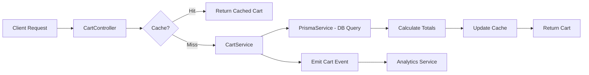

# Shopping Cart System Implementation Plan

**Project:** MASH E-Commerce Cart System  
**Date:** November 13, 2025  
**Purpose:** Complete shopping cart functionality for mushroom products e-commerce platform

---

## 📋 Table of Contents

1. [Overview](#overview)
2. [Database Schema Design](#database-schema-design)
3. [API Endpoints](#api-endpoints)
4. [Business Logic & Rules](#business-logic--rules)
5. [Implementation Phases](#implementation-phases)
6. [Technical Architecture](#technical-architecture)
7. [Performance Optimization](#performance-optimization)
8. [Testing Strategy](#testing-strategy)
9. [Security Considerations](#security-considerations)
10. [Migration Path](#migration-path)

---

## 🎯 Overview

### Goals
- Enable users to add mushroom products to shopping carts
- Support guest and authenticated user carts
- Persist cart data across sessions
- Handle stock validation and inventory checks
- Support cart merging (guest → authenticated user)
- Optimize for high-traffic e-commerce scenarios

### Features
- ✅ Add/remove/update cart items
- ✅ Cart persistence (Redis + PostgreSQL)
- ✅ Stock validation in real-time
- ✅ Guest cart support (session-based)
- ✅ Cart expiration and cleanup
- ✅ Cart abandonment tracking
- ✅ Price locking (prevent price changes during checkout)
- ✅ Quantity limits per product
- ✅ Cart value calculations (subtotal, tax, shipping)

---

## 🗄️ Database Schema Design

### 1. Cart Model (PostgreSQL)

```prisma
model Cart {
  id              String      @id @default(cuid())
  userId          String?     // Null for guest carts
  sessionId       String?     // For guest cart tracking
  status          CartStatus  @default(ACTIVE)
  subtotal        Decimal     @default(0) @db.Decimal(10, 2)
  tax             Decimal     @default(0) @db.Decimal(10, 2)
  shipping        Decimal     @default(0) @db.Decimal(10, 2)
  discount        Decimal     @default(0) @db.Decimal(10, 2)
  total           Decimal     @default(0) @db.Decimal(10, 2)
  currency        String      @default("PHP")
  expiresAt       DateTime?   // Auto-expire inactive carts
  convertedAt     DateTime?   // When guest cart converted to user cart
  abandonedAt     DateTime?   // For abandoned cart recovery
  lastActivityAt  DateTime    @default(now())
  metadata        Json?       // Promo codes, notes, etc.
  createdAt       DateTime    @default(now())
  updatedAt       DateTime    @updatedAt
  
  user            User?       @relation(fields: [userId], references: [id], onDelete: Cascade)
  items           CartItem[]
  
  @@unique([userId])
  @@unique([sessionId])
  @@index([userId, status])
  @@index([sessionId, status])
  @@index([status, expiresAt])
  @@index([status, lastActivityAt])
  @@index([abandonedAt])
  @@map("carts")
}

model CartItem {
  id              String      @id @default(cuid())
  cartId          String
  productId       String
  quantity        Int         @default(1)
  price           Decimal     @db.Decimal(10, 2) // Price at time of adding
  originalPrice   Decimal?    @db.Decimal(10, 2) // For price comparison
  subtotal        Decimal     @db.Decimal(10, 2) // quantity * price
  discount        Decimal     @default(0) @db.Decimal(10, 2)
  total           Decimal     @db.Decimal(10, 2) // subtotal - discount
  productSnapshot Json?       // Product details at time of adding
  customization   Json?       // Gift messages, special instructions
  isAvailable     Boolean     @default(true) // Stock availability flag
  unavailableReason String?   // Out of stock, discontinued, etc.
  addedAt         DateTime    @default(now())
  updatedAt       DateTime    @updatedAt
  
  cart            Cart        @relation(fields: [cartId], references: [id], onDelete: Cascade)
  product         Product     @relation(fields: [productId], references: [id])
  
  @@unique([cartId, productId])
  @@index([cartId])
  @@index([productId])
  @@index([cartId, isAvailable])
  @@map("cart_items")
}

enum CartStatus {
  ACTIVE          // Currently being used
  COMPLETED       // Converted to order
  ABANDONED       // User left without checking out
  EXPIRED         // Exceeded expiration time
  MERGED          // Guest cart merged into user cart
}
```

### 2. Update Product Model

```prisma
model Product {
  id             String      @id @default(cuid())
  name           String
  description    String?
  slug           String      @unique
  sku            String?     @unique
  price          Decimal     @db.Decimal(10, 2)
  comparePrice   Decimal?    @db.Decimal(10, 2)
  costPrice      Decimal?    @db.Decimal(10, 2)
  stock          Int         @default(0)
  minStock       Int         @default(0)
  maxCartQty     Int?        // NEW: Max quantity per cart
  weight         Float?
  dimensions     Json?
  images         Json[]
  categories     Json[]
  tags           Json[]
  attributes     Json?
  isActive       Boolean     @default(true)
  isFeatured     Boolean     @default(false)
  seoTitle       String?
  seoDescription String?
  createdAt      DateTime    @default(now())
  updatedAt      DateTime    @updatedAt
  deletedAt      DateTime?
  isDeleted      Boolean     @default(false)
  
  orderItems     OrderItem[]
  cartItems      CartItem[]  // NEW: Relationship to cart items

  @@index([isActive, isFeatured, createdAt(sort: Desc)])
  @@index([slug, isActive])
  @@index([stock, minStock])
  @@index([createdAt])
  @@index([isDeleted, isActive])
  @@map("products")
}
```

### 3. Update User Model

```prisma
model User {
  // ... existing fields ...
  carts           Cart[]      // NEW: User's carts (should only have 1 active)
  // ... rest of existing relations ...
}
```

---

## 🔌 API Endpoints

### Base Path: `/api/v1/cart`

#### 1. Get Cart
```typescript
GET /api/v1/cart
Response: {
  id: string;
  items: CartItem[];
  subtotal: number;
  tax: number;
  shipping: number;
  discount: number;
  total: number;
  itemCount: number;
  currency: string;
  lastActivityAt: string;
}
```

#### 2. Add Item to Cart
```typescript
POST /api/v1/cart/items
Body: {
  productId: string;
  quantity: number;
  customization?: Record<string, any>;
}
Response: CartItem
```

#### 3. Update Cart Item
```typescript
PUT /api/v1/cart/items/:itemId
Body: {
  quantity: number;
  customization?: Record<string, any>;
}
Response: CartItem
```

#### 4. Remove Cart Item
```typescript
DELETE /api/v1/cart/items/:itemId
Response: { success: true; message: string; }
```

#### 5. Clear Cart
```typescript
DELETE /api/v1/cart
Response: { success: true; message: string; }
```

#### 6. Validate Cart
```typescript
POST /api/v1/cart/validate
Response: {
  valid: boolean;
  items: Array<{
    itemId: string;
    productId: string;
    isAvailable: boolean;
    currentStock: number;
    requestedQuantity: number;
    priceChanged: boolean;
    oldPrice?: number;
    newPrice?: number;
  }>;
}
```

#### 7. Apply Coupon/Discount
```typescript
POST /api/v1/cart/discount
Body: {
  code: string;
  type: 'COUPON' | 'PROMO';
}
Response: Cart
```

#### 8. Estimate Shipping
```typescript
POST /api/v1/cart/shipping/estimate
Body: {
  address: {
    city: string;
    state: string;
    postalCode: string;
    country: string;
  };
}
Response: {
  shippingOptions: Array<{
    method: string;
    cost: number;
    estimatedDays: number;
  }>;
}
```

#### 9. Merge Guest Cart (on login)
```typescript
POST /api/v1/cart/merge
Body: {
  guestSessionId: string;
}
Response: Cart
```

#### 10. Get Cart Summary
```typescript
GET /api/v1/cart/summary
Response: {
  itemCount: number;
  total: number;
  hasUnavailableItems: boolean;
}
```

---

## 🎯 Business Logic & Rules

### 1. Stock Management
```typescript
// Stock validation rules
- Check product.stock >= cartItem.quantity
- Reserve stock when item added to cart (soft reserve for 30 min)
- Release reserved stock on cart expiration/item removal
- Real-time stock updates via WebSocket
- Prevent over-selling (atomic stock updates)
```

### 2. Cart Expiration
```typescript
// Expiration rules
- Guest carts: 7 days of inactivity
- User carts: 30 days of inactivity
- Abandoned carts: 3 hours after last activity
- Send reminder emails for abandoned carts (24hr, 48hr, 72hr)
```

### 3. Price Locking
```typescript
// Price management
- Lock price when item added to cart
- Store original price for comparison
- Show price change warning if product.price !== cartItem.price
- User must confirm price change to proceed to checkout
```

### 4. Quantity Limits
```typescript
// Quantity validation
- Min quantity: 1
- Max quantity: product.maxCartQty || product.stock
- Bulk order threshold: Show "Request Quote" for qty > 50
```

### 5. Cart Merging Strategy
```typescript
// Guest → User cart merge
1. Find active user cart
2. Iterate guest cart items
3. For each item:
   - If exists in user cart: quantity = user.qty + guest.qty (respect maxCartQty)
   - If not exists: Add to user cart
4. Validate merged cart (stock, limits)
5. Mark guest cart as MERGED
6. Update user cart totals
```

---

## 📦 Implementation Phases

### **Phase 1: Database & Models** (Week 1)
- [ ] Create Prisma schema for Cart and CartItem
- [ ] Add CartStatus enum
- [ ] Update Product model with cartItems relation
- [ ] Update User model with carts relation
- [ ] Generate and run migration
- [ ] Create seed data for testing

### **Phase 2: Core Cart Service** (Week 1-2)
- [ ] Create `CartService` class
- [ ] Implement `getOrCreateCart(userId?, sessionId?)`
- [ ] Implement `addItem(cartId, productId, quantity)`
- [ ] Implement `updateItem(cartId, itemId, quantity)`
- [ ] Implement `removeItem(cartId, itemId)`
- [ ] Implement `clearCart(cartId)`
- [ ] Implement `calculateTotals(cartId)`
- [ ] Add stock validation logic
- [ ] Add price locking logic

### **Phase 3: Redis Caching Layer** (Week 2)
- [ ] Design Redis cart cache structure
  ```typescript
  Key: cart:user:{userId} | cart:session:{sessionId}
  TTL: 24 hours
  Value: JSON of cart with items
  ```
- [ ] Implement `CachedCartService` wrapper
- [ ] Add cache invalidation on updates
- [ ] Add cache warming strategy
- [ ] Add cache hit/miss metrics

### **Phase 4: API Controllers & DTOs** (Week 2-3)
- [ ] Create `CartController`
- [ ] Create DTOs:
  - `AddToCartDto`
  - `UpdateCartItemDto`
  - `ApplyDiscountDto`
  - `EstimateShippingDto`
  - `CartResponseDto`
  - `CartItemResponseDto`
- [ ] Add request validation (class-validator)
- [ ] Add rate limiting (10 req/sec per user)
- [ ] Add Swagger documentation

### **Phase 5: Advanced Features** (Week 3-4)
- [ ] Implement guest cart tracking (session-based)
- [ ] Implement cart merge on login
- [ ] Implement cart expiration scheduler (cron job)
- [ ] Implement abandoned cart detection
- [ ] Implement stock reservation system
- [ ] Add real-time stock updates (WebSocket)
- [ ] Add cart event emitters for analytics

### **Phase 6: Integration** (Week 4)
- [ ] Integrate with order creation flow
- [ ] Add shipping cost calculation
- [ ] Add tax calculation (based on region)
- [ ] Add coupon/promo code validation
- [ ] Add loyalty points/rewards integration
- [ ] Mark cart as COMPLETED on order creation

### **Phase 7: Monitoring & Analytics** (Week 5)
- [ ] Add Prometheus metrics:
  - `cart_items_added_total`
  - `cart_items_removed_total`
  - `cart_abandonment_rate`
  - `cart_conversion_rate`
  - `average_cart_value`
  - `cache_hit_rate`
- [ ] Add logging for cart operations
- [ ] Add audit trail for cart modifications
- [ ] Create admin dashboard for cart analytics

### **Phase 8: Testing** (Week 5-6)
- [ ] Unit tests for CartService (80%+ coverage)
- [ ] Integration tests for API endpoints
- [ ] E2E tests for cart flow
- [ ] Load testing (1000 concurrent carts)
- [ ] Stock race condition testing
- [ ] Cache consistency testing

---

## 🏗️ Technical Architecture

### Service Layer Structure

```typescript
src/modules/cart/
├── cart.module.ts
├── cart.controller.ts
├── cart.service.ts
├── cart-cache.service.ts
├── cart-events.service.ts
├── cart-scheduler.service.ts
├── dto/
│   ├── add-to-cart.dto.ts
│   ├── update-cart-item.dto.ts
│   ├── apply-discount.dto.ts
│   ├── estimate-shipping.dto.ts
│   ├── cart-response.dto.ts
│   └── cart-item-response.dto.ts
├── entities/
│   ├── cart.entity.ts
│   └── cart-item.entity.ts
├── guards/
│   └── cart-ownership.guard.ts
├── interceptors/
│   └── cart-session.interceptor.ts
├── cart.service.spec.ts
└── cart.controller.spec.ts
```

### Data Flow



### Redis Cache Strategy

```typescript
// Cache structure
{
  "cart:user:clxxxx": {
    id: "cart_123",
    items: [...],
    totals: {...},
    cachedAt: "2025-11-13T10:00:00Z",
    version: 1
  }
}

// Cache operations
- SET with 24h TTL on cart read
- DEL on cart update/delete
- INCR version on update (optimistic locking)
- Use Redis transactions for atomic operations
```

---

## ⚡ Performance Optimization

### 1. Database Optimization

```sql
-- Composite indexes for fast lookups
CREATE INDEX idx_cart_user_status ON carts(userId, status);
CREATE INDEX idx_cart_session_status ON carts(sessionId, status);
CREATE INDEX idx_cart_item_availability ON cart_items(cartId, isAvailable);
CREATE INDEX idx_cart_activity ON carts(status, lastActivityAt);
```

### 2. Query Optimization

```typescript
// Use selective field fetching
const cart = await prisma.cart.findUnique({
  where: { userId },
  select: {
    id: true,
    subtotal: true,
    total: true,
    items: {
      select: {
        id: true,
        quantity: true,
        price: true,
        product: {
          select: {
            id: true,
            name: true,
            slug: true,
            images: true,
            stock: true,
          }
        }
      }
    }
  }
});

// Batch operations for multiple items
await prisma.$transaction([
  prisma.cartItem.createMany({ data: items }),
  prisma.cart.update({ where: { id }, data: { total: newTotal } })
]);
```

### 3. Caching Strategy

```typescript
// Multi-layer caching
1. Redis: Full cart object (24h TTL)
2. In-memory: Cart summary (5min TTL)
3. CDN: Product images

// Cache warming on login
await warmUserCache(userId);

// Preload frequently accessed products
await warmPopularProducts();
```

### 4. Stock Reservation

```typescript
// Soft reserve stock for 30 minutes
await redis.setex(
  `stock:reserved:${productId}`,
  1800, // 30 min
  quantity
);

// Release on checkout or timeout
await releaseStockReservation(productId, quantity);
```

---

## 🧪 Testing Strategy

### 1. Unit Tests

```typescript
describe('CartService', () => {
  it('should add item to cart', async () => {...});
  it('should prevent adding out-of-stock items', async () => {...});
  it('should respect maxCartQty limit', async () => {...});
  it('should calculate totals correctly', async () => {...});
  it('should merge guest cart into user cart', async () => {...});
  it('should lock price when adding item', async () => {...});
});
```

### 2. Integration Tests

```typescript
describe('Cart API', () => {
  it('POST /cart/items - should add item', async () => {...});
  it('GET /cart - should return cart with items', async () => {...});
  it('PUT /cart/items/:id - should update quantity', async () => {...});
  it('DELETE /cart/items/:id - should remove item', async () => {...});
  it('POST /cart/validate - should detect stock issues', async () => {...});
});
```

### 3. E2E Tests

```typescript
describe('Cart Flow', () => {
  it('should complete full cart → checkout → order flow', async () => {
    // Add items
    // Apply discount
    // Validate cart
    // Estimate shipping
    // Create order
    // Verify cart marked COMPLETED
  });
});
```

### 4. Load Testing (Artillery/k6)

```yaml
config:
  target: 'http://localhost:3000'
  phases:
    - duration: 60
      arrivalRate: 50 # 50 users per second
scenarios:
  - name: 'Add to cart'
    flow:
      - post:
          url: '/api/v1/cart/items'
          json:
            productId: '{{ $randomString() }}'
            quantity: 1
```

---

## 🔒 Security Considerations

### 1. Cart Ownership Validation

```typescript
@UseGuards(CartOwnershipGuard)
@Put('/cart/items/:id')
async updateItem(@Param('id') id: string, @User() user) {
  // Guard ensures cartItem belongs to user's cart
}
```

### 2. Rate Limiting

```typescript
@Throttle(10, 60) // 10 requests per 60 seconds
@Post('/cart/items')
async addItem(...) {...}
```

### 3. Input Validation

```typescript
export class AddToCartDto {
  @IsString()
  @IsNotEmpty()
  productId: string;

  @IsInt()
  @Min(1)
  @Max(1000)
  quantity: number;

  @IsOptional()
  @IsObject()
  customization?: Record<string, any>;
}
```

### 4. SQL Injection Prevention

```typescript
// Prisma automatically sanitizes inputs
await prisma.cart.findUnique({
  where: { id: userProvidedId } // Safe with Prisma
});
```

### 5. Session Security

```typescript
// Use HttpOnly cookies for session IDs
res.cookie('session_id', sessionId, {
  httpOnly: true,
  secure: true,
  sameSite: 'strict',
  maxAge: 7 * 24 * 60 * 60 * 1000 // 7 days
});
```

---

## 🔄 Migration Path

### Step 1: Create Migration

```bash
npx prisma migrate dev --name add_cart_system
```

### Step 2: Seed Test Data

```typescript
// prisma/seed-cart.ts
async function seedCarts() {
  // Create 50 test carts with items
  for (let i = 0; i < 50; i++) {
    await prisma.cart.create({
      data: {
        userId: testUsers[i % 10].id,
        status: 'ACTIVE',
        items: {
          create: [
            {
              productId: products[0].id,
              quantity: 2,
              price: products[0].price,
              subtotal: products[0].price * 2,
              total: products[0].price * 2,
            }
          ]
        }
      }
    });
  }
}
```

### Step 3: Deploy with Zero Downtime

```bash
# 1. Add new tables (backward compatible)
npx prisma migrate deploy

# 2. Deploy new API endpoints (feature flag)
ENABLE_CART_SYSTEM=true npm run start

# 3. Monitor metrics
# 4. Enable for all users
# 5. Remove feature flag
```

---

## 📊 Success Metrics

### Key Performance Indicators (KPIs)

```typescript
// Performance
- Cart API response time: < 100ms (95th percentile)
- Cache hit rate: > 90%
- Database query time: < 50ms

// Business
- Cart abandonment rate: < 70%
- Cart to order conversion: > 20%
- Average items per cart: 2-5
- Average cart value: ₱500+

// Technical
- API error rate: < 0.1%
- Stock accuracy: 99.9%
- Concurrent cart capacity: 1000+
```

---

## 🚀 Quick Start Commands

```bash
# Generate migration
npx prisma migrate dev --name add_cart_system

# Generate Prisma Client
npx prisma generate

# Create cart module
nest g module modules/cart
nest g controller modules/cart
nest g service modules/cart

# Run tests
npm test src/modules/cart

# Start development
npm run start:dev
```

---

## 📝 Next Steps

### Immediate Actions:
1. ✅ Review and approve this plan
2. ⏳ Create Prisma schema changes
3. ⏳ Generate migration
4. ⏳ Implement Phase 1 (Database & Models)
5. ⏳ Set up Redis connection for caching

### Future Enhancements:
- 🔮 Wishlist functionality
- 🔮 "Frequently bought together" recommendations
- 🔮 Cart sharing (send cart link)
- 🔮 Save for later feature
- 🔮 Multi-currency support
- 🔮 Subscription boxes for recurring mushroom deliveries

---

## 📚 References

- [NestJS Best Practices](https://docs.nestjs.com/fundamentals)
- [Prisma E-commerce Guide](https://www.prisma.io/docs/guides)
- [Redis Caching Patterns](https://redis.io/docs/manual/patterns/)
- [E-commerce Cart Design Patterns](https://stripe.com/docs/checkout)

---

**Document Version:** 1.0  
**Last Updated:** November 13, 2025  
**Status:** 📋 Planning Phase  
**Next Review:** After Phase 1 completion
